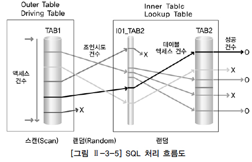

# SQLD 요약

## 1과목 1장 데이터 모델링의 이해

**데이터 모델링 유의 사항 **: 중복성, 비유연성, 비일관성

- 중복성 : 여러 장소에 같은 데이터를 반복하여 저장하지 않아야함
- 비유연성 : 데이터의 정의를 데이터의 사용 프로세스와 분리해 데이터 모델링은 데이터 혹은 프로세스의 작은 변화가 애플리케이션과 데이터베이스에 중대한 변화를 일으킬 수 있는 가능성을 줄인다.
- 비일관성 : 데이터 모델링을 할 때 데이터와 데이터 간의 상호 연관 관계에 대해 명확하게 정의함, 사용자가 처리하는 프로세스 혹은 이와 관련된 프로그램과 테이블의 연계성을 높이는 것은 데이터 모델이 업무 변경에 대해 취약하게 만드는 단점에 해당함.

### 엔터티의 특징

1. 반드시 해당 업무에서 필요하고 관리하고자 하는 정보여야한다.
2. 유일한 식별자에 의해 식별이 가능햐여함
3. 영속적으로 존재하는(두 개 이상의) 인스턴스의 집합이어야한다.
4. 엔터티는 업무 프로세스에 의해 이용되어야 한다.
5. 엔터티는 반드시 속성이 있어야한다.
6. 엔터티는 다른 엔터티와 최소 한 개 이상의 관계가 있어야 한다.

**인스턴스**

- 하나의 인스턴스에서 각각의 속성은 한 개의 속성값을 가져야함

### 관계 표기법

관계명, 관계차수, 선택성(선택사양)의 3가지 개념으로 표현한다.

## 1과목 2장 데이터 모델과 성능

### 정규화

| 정규화      | 설명                                                         |
| ----------- | ------------------------------------------------------------ |
| 제 1 정규화 | 테이블의 컬럼이 원자값을 갖도록 테이블을 분해하는 것         |
| 제 2 정규화 | 1 정규화가 된 테이블에 완전 함수 종속을 만족하도록 테이블을 분해하는 것 |
| 제 3 정규화 | 2 정규화가 된 테이블에 이행적 종속을 없애도록 테이블을 분해라는 것 이행적 종속 : A→B→C가 성립할 때 A→C가 되는 것을 의미 |

### 테이블의 반정규화

| 기법 분류   | 반정규화 기법             |
| ----------- | ------------------------- |
| 테이블 병합 | 1 : 1 관계 테이블 병합    |
|             | 1 : M 관계 테이블 병합    |
|             | 슈퍼/서브타입 테이블 병합 |
| 테이블 분할 | 수직 분할                 |
|             | 수평 분할                 |
| 테이블 추가 | 중복 테이블 추가          |
|             | 통계 테이블 추가          |
|             | 이력 테이블 추가          |
|             | 부분 테이블 추가          |

### 칼럼의 반정규화

| 반정규화 기법                        |
| ------------------------------------ |
| 중복 칼럼 추가                       |
| 파생 칼럼 추가                       |
| 이력 테이블 칼럼 추가                |
| PK에 의한 칼럼 추가                  |
| 응용프로그램 오작동을 위한 칼럼 추가 |

### 파티셔닝

하나의 테이블에 많은 양의 데이터가 저장되면 인덱스를 추가하고 테이블을 몇 개로 쪼개도 성능이 저하되는 경우가 있다. 이때 논리적으로는 하나의 테이블이지만 물리적으로는 여러 개의 테이블로 분리하여 데이터 액세스 성능도 향상 시키고, 데이터 관리 방법도 개선할 수 있도록 테이블에 적용하는 기법을 **파티셔닝** 이라고 한다.

### 트랜잭션

트랜잭션은 **항상 전체를 통합하여 분석 처리하는데** 슈퍼-서브타입이 하나의 테이블로 통합되어 있으면 하나의 테이블에 집적된 데이터만 읽어 처리 할 수 있기 때문에 **다른 형식에 비해 더 성능이 우수하다.**

**분산 데이터베이스 장단점**

장점

- 지역 자치성, 점증적 시스템 용량 확장
- 신뢰성과 가용성
- 효용성과 융통성
- 빠른 응답 속도와 통신 비용 절감
- 데이터의 가용성과 신뢰성 증가
- 시스템 규모의 적절한 조절
- 각 지역 사용자의 요구 수용 증대

단점

- 소프트웨어 개발 비용
- 오류의 잠재성 증대
- 설계, 관리의 복잡성과 비용
- 불규칙한 응답 속도
- 통제의 어려움
- 데이터 무결성에 대한 위협

**GSI(Global Single Instance)**

통합된 하나의 인스턴스 즉, 통합 데이터베이스 구조를 의미함. (분산 데이터베이스와 대치되는 개념)

## 2과목 

**데이터 조작어(DML) **: SELECT, INSERT, UPDATE, DELETE

**데이터 정의어(DDL)** : CREATE, ALTER, DROP, RENAME

**데이터 제어어(DCL)** : GRANT, REVOKE

**트랜젝션 제어어(TCL)** : COMMIT, ROLLBACK

 

As-Is : 비절차적 데이터 조작어(DML)는 사용자가 무슨 데이터를 원하는 지만을 명세함

To-Be : 절차적 데이터 조작어는 어떻게 데이터를 접근 하는지 명세함 (PL/SQL(오라클),T-SQL(SQL Serve))

### Delete(/Modify) Action : Cascade, Set Null, Set Default, Restrict

1.  Cascade : Master 삭제 시 Child 같이 삭제
2.  Set Null : Master 삭제 시 Child 해당 필드 NULL
3.  Set Default : Master 삭제 시 Child 해당 필드 Default 값으로 설정
4.  Restrict : Child 테이블에 PK 값이 없는 경우만 Master 삭제 허용
5. No Action : 참조무결성을 위반하는 삭제/수정 액션을 취하지 않음

### Insert Action : Automatic, Set Null, Set Default, Dependent

1.  Automatic : Master 테이블에 PK가 없는 경우 Master PK를 생성 후 Child 입력
2. Set Null :  Master 테이블에 PK가 없는 경우 Child 외부키를 NULL값으로 처리
3.  Set Default : Master 테이블에 PK가 없는 경우 Child 외부키를 지정된 기본값으로 입력
4. Dependent : Master 테이블에 PK가 존재할 때만 Child 입력 허용
5. No Action : 참조무결성을 위반하는 입력 액션을 취하지 않음

## NULL 관련 함수!! (중요)

| 일반형 함수               | 함수 설명                                                    |
| ------------------------- | ------------------------------------------------------------ |
| NVL(A,B) ISNULL(A,B) | A의 결과가 NULL이면 B를 출력함(A,B 타입이 같아야 한다.)      |
| NULLIF(A,B)               | A,B 가 같으면 NULL 같지 않다면 A를 리턴                      |
| COALESCE(A,B,...)         | 임의의 개수 표현식에서 NULL이 아닌 최초의 값을 나타낸다.  모두 NULL이면 NULL 리턴 |

### Trigger의 생성과 활용

- 특정한 테이블에 INSERT, UPDATE, DELETE와 같은 DML문이 수행되었을 때, 데이터 베이스에서 자동으로 동작 하도록 작송된 프로그램

- 즉 사용자가 직접 호출하여 사용하는 것이 아니고 데이터베이스에서 자동으로 수행하게 된다.
  Trigger는 테이블과 뷰, 데이터베이스 작업을 대상으로 정의할 수 있고 전체 트랜젝션 작업에 대해 발생하는 Trigger와 각 행에 대해 발생되는 Trigger가 있다.
- Trigger는 데이터 베이스에 의해 자동 호출되지만 결국 INSERT, UPDATE, DELETE 문과 하나의 트랜젝션 안에서 일어나는 일련의 작업들이라 할 수 있다.
- Trigger는 데이터베이스 보안의 적용, 유효하지않은 트랜젝션의 예방,업무 규칙 자동 적용 제공 등에 사용

### 트리거, 프로시저

| 프로시저                   | 트리거                     |
| -------------------------- | -------------------------- |
| CREATE Procedure 문법 사용 | CREATE Trigger 문법 사용   |
| EXECUTE 명령어로 실행      | 생성 후 자동으로 실행      |
| COMMIT, ROLLBACK 실행 가능 | COMMIT, ROLLBACK 실행 안됨 |

## 3장 옵티마이저

> 다양한 실행 방법 중 최적의 실행 방법을 결정하는 것이 옵티마이저의 역할이다.

### 종류

**규칙 기반 옵티마이저**

- 규칙(우선순위)를 가지고 실행 계획을 생성한다.

**비용 기반 옵티마이저**

- SQL문을 처리하는데 필요한 비용이 가장 적은 실행 계획을 선택하는 방식
- 통계정보, DBMS 버전, DBMS설정 정보 등의 차이로 인해 동일 SQL이라고 다른 실행 계획이 생성될 수 있음
- 비용 기반 옵티마이저의 다양한 한계들로 인해 실행 계획의 예측 및 제어가 어렵다는 단점이 있다.

### 옵티마이저 실행 계획

SQL에서 요구한 사항을 처리하기 위한 절차와 방법

**구성 요소**

- 조인 순서/ 조인 기법/ 액세스 기법/ 최적화 정보/ 연산

---

SQL 흐름도 : SQL의 내부적인 처리 절차를 시각적으로 표현한 도표 

### NL JOIN (주로 랜덤 액세스 방식으로 데이터를 읽음)

- 중접된 반복문과 유사한 방식으로 조인한다.
- 선행 테이블(외부 테이블) - 결과 행 수가 적은 테이블을 선행으로 하면 전체 일량을 줄인다.
- 후행 테이블(내부 테이블)
- 조인이 성공하면 바로 사용자에게 결과를 보여줌. **온라인 프로그램에 적당하다.**

### Sort Merge Join (주로 스캔 방식으로 데이터 읽음)

- 주로 스캔하는 방식으로 데이터를 읽음
- 조인 칼럼 인덱스가 없어도 사용되지만 성능이 떨어질 수 있다.
- 조인 칼럼 기준으로 데이터를 정렬하여 조인을 실행
- sort merge join은 랜덤 액세스로 NL join에서 부담이 되던 넓은 범위의 데이터를 처리할 때 이용되던 기법

### Hash Join

- 조인을 수행할 테이블의 조인 칼럼을 기준으로 해쉬 함수를 수행하여 서로 동일한 해쉬 값을 갖는 것들 사이에서 실제 값이 같은지 비교하면서 조인을 수행
- NL Join과 Sort merge join의 문제점인 정렬 작업의 부담을 해결하기 위한 대안으로 등장~!
- '='로 수행하는 **동등 조인에서만 사용 가능**
- **결과 행 수가 적은 테이블을 선행으로 사용하는 것이 좋다.**

# 단답형 부시기

---

**모델링의 특징 3 가지 **: 추상화, 단순화, 명확화

---

**각 속성이 가질 수 있는 값의 범위를 뜻하는 용어**

도메이

---

**DCL에 속하는 명령어**

GRANT, REVOKE

---

**DDL 명령어**

CREATE, ALTER, DROP, RENAME

---

**SELECT 할 때 데이터 중복 제거하는 키워드**

DISTINCT

---

**트랜젝션특징**

원자성, 일관성, 고립성, 지속성

---

**독립성, 편리성, 보안성 하면 떠오르는 것은?**

뷰

---

**순위가 1 2 3 3 4 5...일 때 함수 **

DENSE_RANK

---

**교집합을 구하는 함수**

INTERSECT

---

**SELECT NULLIF('A','A') FROM DUAL; 결과는?**

NULL (두 값이 같으면 널)

---

**SELECT 문의 논리적 수행 순서**

FROM - WHERE - GROUP BY - HAVING - SELECT - ORDER BY

---

**부모를 삭제하면 자식도 지워지는 옵션은??**

CASCADE

***

**UNION, UNION ALL 차이**

UNION은 중복 데이터 제거한다.

---

**데이터를 빠르게 조회하기 위해 미리 계산된 값이 저장되는 속성?**

파생 속성

---

**계층 쿼리에서 형제 노드 간의 정렬을 지정하는 구문?**

ORDER SIBLINGS BY

---

**의미상 더는 분리되지 않는 최소의 데이터 단위?**

속성

---

**SELECT절에 오는 서브쿼리는?**

스칼라 서브 쿼리

---

**엔터니의 일반 속성 간에는 서로 종속되지 않는다. 떠오르는 것은?**

3정규화

---

**관계의 표기법에 표현되는 개념 3가지**

관계 차수, 관계명, 관계 선택 사양

---

**SELECT COALESCE(NULLIF('A','A'),'B') FROM DUAL 결과는?**

B

---

**SUMMER 테이블 이름을 FALL로 바꾸려면?**

RENAME SUMMER TO FALL;

---

**다양한 권한을 그룹으로 묶어 관리하는 것**

ROLE

---

**사용자에게 권한을 부여하는 명령어**

GRANT

---

**카티션 곱을 생성하는 JOIN**

CROSS JOIN

---

**그룹 함수 3 가지는?**

ROLLUP, CUBE, GROUPING SETS9

---

**SELECT FLOOR(12.5) FROM DUAL; 결과**

12 (소수점 버림)

---

**INSERT, UPDATE를 한방에 할 수 있는 것**

MERGE INTO

---

**차집합을 구하는 연산자?**

MINUS

---

**이름이 같은 컬럼을 기준으로 EQUIJOIN하는 것**

NATURAL JOIN

---

**WHERE 절에서 OR, AND 우선순위가 높은 것은?**

AND

---

**SELECT SIGN(-77) FROM DUAL; 결과**

-1 (양수 : 1, 음수 : -1 구분)

---

**COMMIT, ROLLBACK, SAVEPOINT를 묶어서 뭐라고 하죠?**

TCL

---

**COUNT(*), COUNT(컬럼명)의 차이**

NULL을 세냐(*) 안 세냐(컬럼명)

---

**ORDER BY 에서 NULL을 맨 끝으로 보내는 옵션?**

NULLS LAST  (FIRST, LAST)

---

**DELETE보다 빠르지만 로그가 남지 않아 돌이킬 수 없는 것?**

TRUNCATE

---

**FROM절에 오는 서브 쿼리는?**

인라인 뷰

---

**GROUP BY 할때 사용하는 조건절?**

HAVING

---

**SELECT CEIL(-2.7) FROM DUAL; 결과**

-2 (소수점 올리는거임)

---

**날짜형 데이터를 문자형으로 변환하는 함수?**

TO_CHAR

---

**계층 쿼리에서 가장 상위 LEVEL 값은?**

1

---

**SELECT SUBSTR('NEXT LEVEL',-5,3) FROM DUAL; 결과는?**

LEV

---

**둘 이상의 속성으로 구성된 식별자**

복합 식별자

---

**주어진 문자열을 대문자로 변환하는 함수**

UPPER

---

